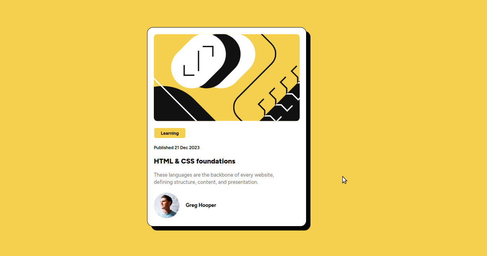

# Frontend Mentor - Blog preview card solution

This is a solution to the [Blog preview card challenge on Frontend Mentor](https://www.frontendmentor.io/challenges/blog-preview-card-ckPaj01IcS). Frontend Mentor challenges help you improve your coding skills by building realistic projects. 

## Table of contents

- [Overview](#overview)
  - [The challenge](#the-challenge)
  - [Screenshot](#screenshot)
  - [Links](#links)
  - [My process](#my-process)
  - [Built with](#built-with)
  - [What I learned](#what-i-learned)
  - [Continued development](#continued-development)
  - [Author](#author)

## Overview

### The challenge

Users should be able to:

- See hover and focus states for all interactive elements on the page

### Screenshot

A
### Links

- Solution URL: [https://github.com/vipinsharmaa/blog-preview-card-Frontend-mentor](https://github.com/vipinsharmaa/blog-preview-card-Frontend-mentor)
- Live Site URL: [https://vipinsharmaa.github.io/blog-preview-card-Frontend-mentor/](https://vipinsharmaa.github.io/blog-preview-card-Frontend-mentor/)

## My process

### Built with

- Semantic HTML5 markup
- CSS custom properties
- Flexbox
- Mobile-first workflow

### What I learned

### Continued development

### Useful resources

## Author

- Frontend Mentor - [@vipinsharmaa](https://www.frontendmentor.io/profile/vipinsharmaa)
- Twitter - [@codecrash007](https://www.twitter.com/codecrash007)

**Note: Delete this note and add/remove/edit lines above based on what links you'd like to share.**

